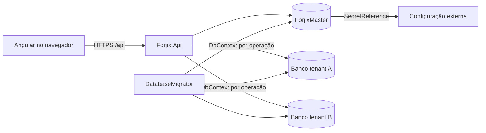

# Visão geral

## Produto observado no código

Forjix é uma aplicação web de gestão comercial multiempresa. A V1 contém administração de usuários e grupos, catálogo, estoque, clientes, fornecedores, compras, vendas/PDV, caixa, dashboard, relatórios, configurações do tenant e auditoria. O backend mantém um catálogo central (`ForjixMaster`) e abre um banco SQL Server separado para cada tenant. O frontend Angular consome a API por URLs relativas `/api`.

O repositório não contém fiscal, TEF/gateway de pagamento, aplicativo mobile nem comportamento multiunidade. `Forjix.Integrations` existe como limite arquitetural, mas contém somente `IntegrationAssemblyMarker`.

## Projetos da solution

| Projeto | Tipo | Responsabilidade comprovada |
| --- | --- | --- |
| `Forjix.Domain` | biblioteca .NET | Entidades, enums e regras de domínio sem dependências de EF/HTTP. |
| `Forjix.Application` | biblioteca .NET | Casos de uso, contratos de entrada/saída e abstrações de infraestrutura. |
| `Forjix.Infrastructure` | biblioteca .NET | EF Core/SQL Server, autenticação JWT, autorização, tenancy, stores, secrets e arquivos locais. |
| `Forjix.Integrations` | biblioteca .NET | Fronteira reservada para adaptadores externos; atualmente só possui um marcador de assembly. |
| `Forjix.Api` | ASP.NET Core Web | Composição, controllers, middleware, cookies, health checks e hospedagem do Angular. |
| `Forjix.DatabaseMigrator` | console .NET | Aplica migrations Master/tenant e executa provisionamentos explicitamente habilitados. |
| `Forjix.Domain.Tests` | xUnit | Regras de estoque, cancelamento de venda e associação usuário–papel. |
| `Forjix.Application.Tests` | xUnit | Fluxos de autenticação e estabilidade de chave de configuração. |
| `Forjix.IntegrationTests` | xUnit/WebApplicationFactory | Limites HTTP/autorização e suíte real SQL Server multi-tenant. |

O frontend `web/forjix-web` é um projeto Angular separado do `.sln`, construído por npm e incorporado ao `wwwroot` da API no Dockerfile.

## Topologia

## Fluxos centrais

1. No login, o slug é normalizado e pesquisado no Master; apenas tenant ativo com assinatura ativa é aceito.
2. O Master entrega metadados e uma `SecretReference`; `ConfigurationSecretProvider` resolve a connection string fora do banco.
3. A identidade é validada no banco do tenant, e a API emite JWT curto mais refresh token em cookie protegido.
4. Requisições autenticadas obtêm tenant e usuário das claims. Cada store cria seu próprio `TenantDbContext` com a conexão resolvida.
5. Permissões são verificadas no banco do tenant por policies dinâmicas.
6. Operações comerciais relevantes gravam `AuditLog`; estoque, vendas, compras e caixa usam transações e `rowversion` em pontos concorrentes.

## Estado dos testes

`dotnet test --list-tests` descobriu 52 casos: 11 em Domain, 12 em Application e 29 em Integration. Dentro dos 29 de integração, 23 usam atributos `SqlFact`/`SqlTheory` e só executam com `FORJIX_RUN_SQL_TESTS=true` e bancos CI provisionados. O frontend tem 2 especificações Jasmine em `app.spec.ts`.

Na validação local desta documentação, `dotnet test Forjix.sln --no-restore` concluiu sem falhas: 29 casos passaram e os 23 casos SQL condicionais foram ignorados por falta do opt-in de infraestrutura.

## Fontes primárias desta documentação

Esta documentação foi derivada da solution, `.csproj`, classes de domínio/aplicação/infra/API, snapshots e migrations EF, migrator, testes, fontes Angular, Docker/Render e documentação já existente no repositório. Não foram consultados bancos ativos nem segredos locais.
