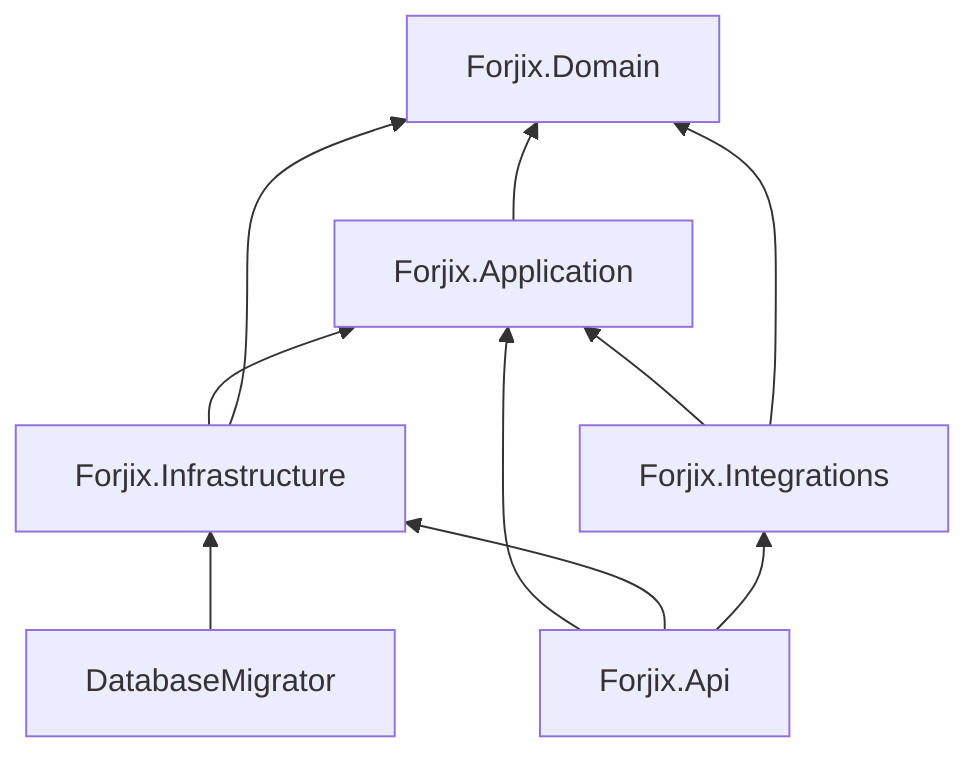
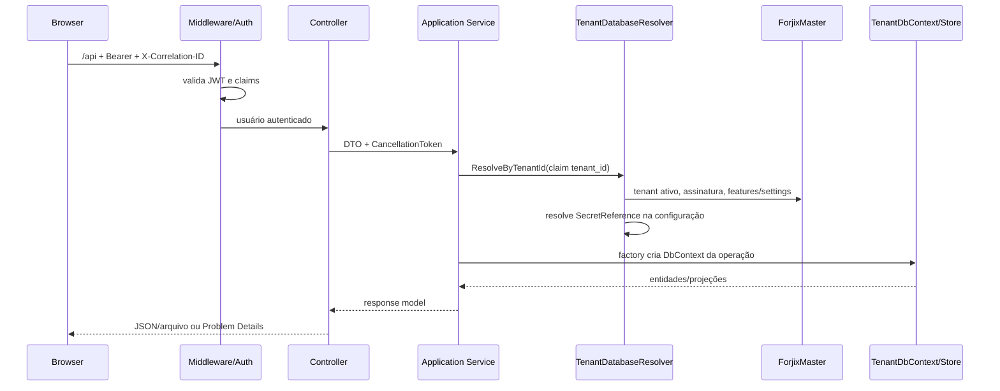

# Arquitetura

## Estilo e dependências

A solution aplica uma separação em camadas próxima de Clean Architecture, com dependências apontando para dentro. Não há mediator, CQRS formal nem repositório genérico; os casos de uso são serviços de aplicação e as portas são interfaces específicas.

### Camadas

- **Domain:** entidades e enums. `Inventory.ApplyMovement`, `Sale.Cancel`, `Purchase.Receive/Cancel` e `CashSession.Close` preservam regras locais.
- **Application:** serviços de caso de uso, validação, DTOs e abstrações (`I*Store`, factories, tenancy, autenticação e identidade atual).
- **Infrastructure:** implementações técnicas: DbContexts/configurações EF, stores SQL, JWT, hashing, permission handler, secret provider e arquivos.
- **Integrations:** limite vazio para futuros adapters; nenhum provider está implementado.
- **API:** boundary HTTP, autenticação/cookie, autorização declarativa, middleware, DI e hosting da SPA.

## Fluxo de uma requisição autenticada

## Pipeline HTTP

1. Em Render, `ForwardedHeaders` processa um salto de `X-Forwarded-For`/`X-Forwarded-Proto`.
2. `CorrelationIdMiddleware` aceita ou cria `X-Correlation-ID`, configura `TraceIdentifier` e contexto Serilog.
3. `GlobalExceptionHandler` traduz exceções conhecidas em 400/403/404/409; exceções inesperadas viram 500 sem detalhe interno.
4. Serilog registra a requisição.
5. OpenAPI é mapeado apenas em Development; HSTS é usado fora dele.
6. HTTPS redirect, arquivos estáticos, CORS, rate limiting, autenticação e autorização.
7. Controllers e health checks.
8. Fallbacks específicos impedem `/api/*` e `/openapi/*` de cair na SPA; demais rotas recebem `index.html`.

## Injeção de dependência

`AddApplication` registra dez serviços scoped. `AddInfrastructure` registra o Master DbContext, factories/stores scoped, `CurrentUser`, resolver e handlers; `TimeProvider`, password hasher, token generator, token issuer, file storage e secret provider são singletons conforme o código. JWT options são bindadas e validadas no startup.

Cada store operacional recebe um `TenantDbContext` novo por meio de `ITenantDbContextFactory`; a conexão de um DbContext compartilhado não é alterada.

## Padrões efetivamente usados

- Dependency Inversion entre Application e Infrastructure.
- Factory para stores/DbContext tenant-aware.
- DTOs imutáveis com records.
- Policy Provider dinâmico por código de permissão.
- Unit of Work/transação via `DbContext` e transações explícitas.
- Optimistic concurrency por `rowversion`.
- Idempotency key em criação de venda.
- Database-per-tenant e catálogo Master.
- Soft deactivation por `IsActive` para cadastros; não há soft-delete genérico.
- Auditoria de negócio separada de logs Serilog.

## Tratamento de erros

`RequestValidationException`, `PermissionDeniedException`, `ResourceNotFoundException` e `ResourceConflictException` são exceções da Application traduzidas para Problem Details. O `traceId` é acrescentado a todas as respostas produzidas pelo serviço de Problem Details.
