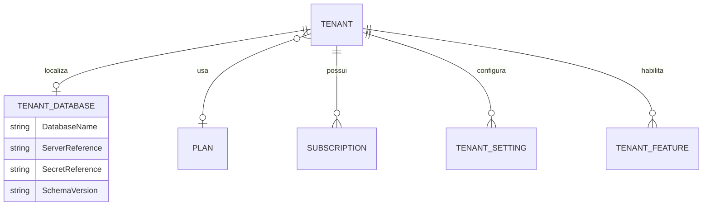
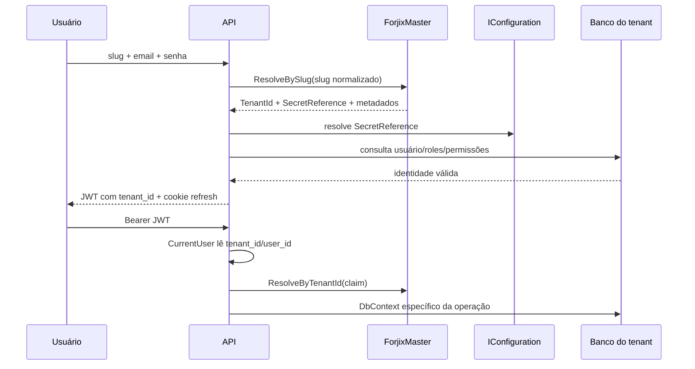

# Multi-tenancy

## Modelo

O isolamento é **database-per-tenant**. O `ForjixMaster` guarda identificação e metadados; cada empresa tem seu próprio schema operacional completo. Não existe `TenantId` nas tabelas comerciais do tenant.

## Identificadores

- `Tenant.Id`: GUID interno incluído na claim `tenant_id`.
- `Tenant.Slug`: identificador humano de login; trim + lowercase no resolver e índice único no Master.
- `TenantDatabase.DatabaseName`: nome informativo/operacional do banco.
- `TenantDatabase.SecretReference`: chave de configuração, por exemplo `TenantDatabases:empresa-demo`; não contém segredo.
- `ServerReference`: metadado persistido pelo provisionador (`development`, `ci` ou `homologation` atualmente); o resolver não o utiliza.

## Resolução

`TenantDatabaseResolver` consulta Master sem tracking e exige simultaneamente:

1. tenant `Active`;
2. `TenantDatabase` presente;
3. ao menos uma assinatura `Active` com início menor/igual ao instante atual e sem fim ou fim futuro.

Depois carrega features habilitadas/não expiradas e settings, entrega `SecretReference` ao `ISecretProvider`, e forma `ResolvedTenantDatabase`. A implementação atual, `ConfigurationSecretProvider`, lê a chave em `IConfiguration`. Ausência do segredo gera `InvalidOperationException` sem revelar a string.

## Login versus requisição autenticada

Somente o login usa slug fornecido pelo cliente. Fluxos autenticados usam `tenant_id` e `user_id` validados no JWT; requests comerciais não recebem conexão, banco ou tenant arbitrário.

## Isolamento no código

- Application services exigem `ICurrentUser.TenantId` antes de criar stores.
- Factories recebem `ResolvedTenantDatabase` e criam um novo `TenantDbContext`.
- Roles, usuários, refresh tokens e auditoria também residem no banco tenant.
- Mesmo e-mail pode existir em bancos diferentes.
- Testes reais verificam connection strings distintas em concorrência, mesmo e-mail entre tenants e isolamento de módulos.

## Settings e features

Settings retornam como dicionário case-insensitive. A sessão expõe atualmente `AllowNegativeStock`; features válidas são entregues em `SessionContext.Features`. Não foram encontrados endpoints para administrar `TenantFeature`, planos, assinaturas ou tenants na V1.
