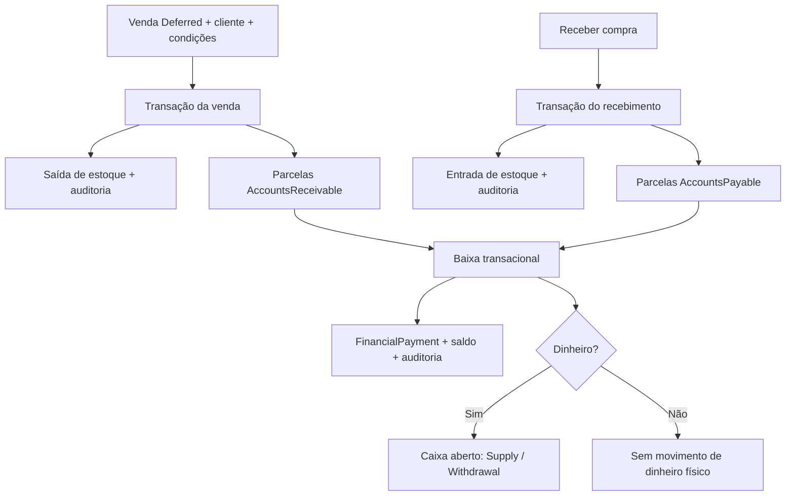

# Financeiro V1

Implementação baseada na arquitetura atual: Domain → Application → Infrastructure; API como fronteira HTTP e Angular standalone/lazy. Nenhuma biblioteca, banco central ou mecanismo de autorização paralelo foi introduzido.

## Componentes e responsabilidade

- Domain: `FinancialCategory`, base abstrata `FinancialAccount`, `AccountReceivable`, `AccountPayable`, `FinancialPayment` e `FinancialRules`. Regras de saldo, baixa, estorno, cancelamento, status e divisão de centavos.
- Application: `IFinancialService`/`FinancialService`, modelos em `FinancialModels.cs`, abstrações `IFinancialStore`/`IFinancialStoreFactory`. Validação de requests, tenant autenticado, datas e auditoria.
- Infrastructure: `FinancialStore`, `FinancialStoreFactory`, `FinancialOriginWriter` e `FinancialModelConfiguration`. SQL Server, transações, projeções, relacionamento com caixa e origens.
- API: `FinancialCategoriesController`, `AccountsReceivableController`, `AccountsPayableController`, `FinancialDashboardController`.
- Angular: `FinancialApiService`, `FinancialAccounts` (reutilizado para pagar/receber), `FinancialCategories`, `FinancialDashboardPage`; rotas `/app/financial/receivable`, `payable`, `categories`, `dashboard`.

DI segue os registros scoped existentes. O store cria um `TenantDbContext` próprio a partir de `ResolvedTenantDatabase`. A API nunca recebe conexão/tenant arbitrários para selecionar banco.

## Modelo físico

Migration: `20260926133300_AddFinancialV1`, exclusivamente no banco de tenant. Não há alteração do ForjixMaster, nem coluna TenantId nas tabelas operacionais.

A herança usa TPC: campos comuns da base são repetidos nas duas tabelas de contas; não existe tabela física `FinancialAccount`.

### FinancialCategories

| Coluna | SQL Server | Nulo | Regra |
|---|---|---|---|
| Id | uniqueidentifier | não | PK |
| Name | nvarchar(120) | não | nome |
| Type | int | não | Income=0 / Expense=1 |
| IsActive | bit | não | desativação lógica |
| CreatedAt | datetimeoffset | não | UTC |
| UpdatedAt | datetimeoffset | não | UTC |

Índice único `(Type, Name)`; check `CK_FinancialCategory_Type`. Não existe endpoint de exclusão. O tipo não pode ser alterado após utilização; categorias inativas permanecem no histórico, mas não aceitam novos títulos.

### AccountsReceivable e AccountsPayable

| Colunas comuns | SQL Server | Nulo | Regra |
|---|---|---|---|
| Id, GroupId | uniqueidentifier | não | Id PK; GroupId agrupa parcelas |
| FinancialCategoryId | uniqueidentifier | não | FK FinancialCategories |
| Description | nvarchar(200) | não | obrigatório |
| Document | nvarchar(100) | sim | referência/documento |
| OriginalAmount, OpenAmount | decimal(18,2) | não | original positivo; saldo entre zero e original |
| IssueDate, DueDate | date | não | vencimento >= emissão |
| PaymentDate | date | sim | data da última baixa, limpa ao estornar |
| Status | int | não | Pending=0, PartiallyPaid=1, Paid=2, Cancelled=4 |
| InstallmentNumber, TotalInstallments | int | não | 1 <= parcela <= total <= 120 |
| Notes | nvarchar(1000) | sim | observação |
| CreatedByUserId, UpdatedByUserId | uniqueidentifier | não | FKs Users |
| CreatedAt, UpdatedAt | datetimeoffset | não | UTC |
| RowVersion | rowversion | não | concorrência otimista |

Colunas específicas (nullable, SQL `uniqueidentifier`):

- AccountsReceivable: `CustomerId` → Customers; `SaleId` → Sales.
- AccountsPayable: `SupplierId` → Suppliers; `PurchaseId` → Purchases.

Índices em cada tabela: vencimento; status+vencimento; único grupo+parcela; categoria; usuários; cliente/fornecedor. Origem+parcela é único filtrado quando SaleId/PurchaseId não é nulo. FKs usam Restrict/NO ACTION, sem exclusão em cascata dos títulos.

Checks específicos `CK_Receivable_*` e `CK_Payable_*`: Amounts, Installments, Status e Dates. Overdue=3 é **calculado**, não persistido: título não cancelado, saldo > 0 e vencimento anterior ao dia atual UTC. A leitura não precisa alterar o banco para reconhecer atraso.

### FinancialPayments

| Colunas | SQL Server | Nulo | Regra |
|---|---|---|---|
| Id | uniqueidentifier | não | PK |
| Type | int | não | Receivable=0 / Payable=1 |
| AccountReceivableId, AccountPayableId | uniqueidentifier | sim | exatamente uma FK preenchida, compatível com Type |
| IdempotencyKey | nvarchar(100) | não | única por banco |
| Amount, PrincipalAmount, Discount, Interest, Penalty | decimal(18,2) | não | valores pagos/principal/ajustes |
| PaymentDate | date | não | sem data futura e não anterior à emissão |
| PaymentMethod | int | não | Cash=0, Pix=1, CreditCard=2, DebitCard=3 |
| Notes | nvarchar(1000) | sim | observação |
| CashMovementId, ReversalCashMovementId | bigint | sim | FKs CashMovements |
| CreatedByUserId | uniqueidentifier | não | FK Users |
| CreatedAt | datetimeoffset | não | UTC |
| ReversedByUserId | uniqueidentifier | sim | FK Users |
| ReversedAt | datetimeoffset | sim | UTC |
| ReversalReason | nvarchar(500) | sim | motivo obrigatório no estorno |
| RowVersion | rowversion | não | concorrência |

Índices: IdempotencyKey único; PaymentDate+Type; contas; usuários; CashMovementId e ReversalCashMovementId únicos filtrados não nulos. Checks: `CK_Payment_Account`, `CK_Payment_Amounts`, `CK_Payment_Method`. FKs Restrict. Pagamentos nunca são excluídos no estorno.

## Regras financeiras

- Dinheiro decimal(18,2), com até duas casas; nunca strings brasileiras persistidas.
- Parcelas de 1 a 120, mínimo um centavo cada. Vencimentos mensais a partir do primeiro; AddMonths preserva a regra de calendário (fim do mês quando necessário).
- R$100 / 3 = R$33,34 + R$33,33 + R$33,33; R$1.200 / 3 = três parcelas de R$400.
- O request de criação contém o total. Ao editar uma parcela, Amount é o valor **daquela parcela**; o grupo não é refeito.
- Principal abatido = Amount + Discount − Interest − Penalty. Exemplo: pago 105, desconto 5, juros 8, multa 2 → principal 100.
- A baixa não pode ultrapassar o saldo **em principal**. Juros/multa podem tornar o pagamento maior que o principal de maneira explícita.
- Baixas parciais/múltiplas são permitidas; saldo zero resulta Paid. Paid/Cancelled rejeitam novas baixas.
- Idempotency-Key obrigatório para baixa. Repetir chave com a mesma conta, tipo, valores, forma e data não cria outro pagamento/movimento. Alterar esses campos com a mesma chave gera 409. Repetir uma chave após estorno não recria a baixa: uma nova baixa exige nova chave.
- RowVersion base64 de oito bytes é obrigatório para editar, cancelar, baixar e estornar (no estorno, versão **do pagamento**). Conflito retorna 409.
- Edição exige ausência de baixas ativas e título manual. Não altera quantidade de parcelas.
- Cancelamento exige motivo e ausência de baixas ativas; saldo permanece histórico, mas fica excluído dos indicadores em aberto.
- Títulos de venda são cancelados pelo cancelamento da venda. Título de compra pode ser cancelado financeiramente com motivo após estornar baixas; isso **não cancela compra recebida nem desfaz estoque**.
- Clientes/fornecedores são opcionais em títulos manuais; quando informados devem existir e estar ativos no banco autenticado. Categoria ativa e tipo compatível são obrigatórios.

## Fluxos integrados



### Vendas / PDV

Novo `PaymentMethod.Deferred` (4, mostrado “A prazo”). Exige cliente ativo e `financialTerms` contendo categoria Income, primeiro vencimento e parcelas. A permissão `financial.receivable.manage` é exigida além da permissão existente de venda.

A venda, estoque, títulos e auditoria usam o mesmo DbContext e transação Serializable. Repetição da venda preserva a idempotência existente; índice SaleId+parcela também protege duplicidade.

Vendas à vista (Cash/PIX/cartões) **não geram título nem FinancialPayment**; comportamento anterior preservado, sem duplicar entradas no caixa. Mesmo Deferred segue a exigência atual do PDV de caixa aberto. Cancelamento de venda rejeita títulos com baixas ativas; após estorno cancela títulos e repõe estoque no mesmo commit.

### Compras

Geração somente ao receber a compra, não ao criar uma compra Pending. Primeiro recebimento gera contas e estoque atomicamente. Repetição de recebimento devolve o conflito já existente, sem duplicar títulos.

`PurchaseActionRequest.financialTerms` é opcional. Ausente: uma parcela, categoria Expense “Compras” criada se necessária, vencimento na data de recebimento. Categoria padrão desativada exige reativação ou categoria específica. Compra de valor zero não gera obrigação. Condições específicas permitem outro vencimento e parcelamento. Valores são arredondados para centavos como o SQL decimal(18,2).

A permissão `purchases.receive` continua autorizando o recebimento e seus efeitos automáticos, inclusive títulos; não concede acesso às telas financeiras.

### Caixa e estorno

Dinheiro usa tipos existentes Supply (recebível) / Withdrawal (pagável). PIX/cartões não alteram o dinheiro físico do caixa.

Sem sessão aberta, baixa/estorno Cash retorna 409 e **nenhuma alteração parcial** de título, pagamento, auditoria ou caixa é salva. A sessão é marcada para atualização da rowversion para disputar corretamente com fechamento concorrente.

Estorno restaura o principal, mantém pagamento original e grava usuário, instante e motivo. Se houve caixa, cria movimento contrário na sessão atualmente aberta, mesmo quando o caixa original já fechou. Nenhuma segunda reversão é aceita.

## API e contratos

Todos os endpoints exigem JWT/tenant autenticado e permission policy existente. Erros seguem ProblemDetails: 400 validação, 403 autorização, 404 inexistente no tenant, 409 conflito/concor­rência.

Categorias:

| Verbo/rota | Request → Response | Permissão |
|---|---|---|
| GET /api/financial/categories?type=Income | filtro opcional → FinancialCategoryView[] | financial.categories.view |
| POST /api/financial/categories | SaveFinancialCategoryRequest → FinancialCategoryView (201) | financial.categories.manage |
| PUT /api/financial/categories/{id} | SaveFinancialCategoryRequest → FinancialCategoryView | financial.categories.manage |

As duas famílias `/api/financial/accounts-receivable` e `/api/financial/accounts-payable` expõem os mesmos oito endpoints. A permissão “prefixo” é `financial.receivable` ou `financial.payable`.

| Verbo/sufixo | Request → Response | Permissão |
|---|---|---|
| GET / | FinancialAccountFilter → PagedFinancialAccounts | prefixo.view |
| GET /{id} | → FinancialAccountView | prefixo.view |
| POST / | SaveFinancialAccountRequest → FinancialAccountView[] (201) | prefixo.manage |
| PUT /{id} | SaveFinancialAccountRequest → FinancialAccountView | prefixo.manage |
| POST /{id}/cancel | FinancialActionRequest → FinancialAccountView | prefixo.manage |
| GET /{id}/payments | → FinancialPaymentView[] | prefixo.view |
| POST /{id}/payments | CreateFinancialPaymentRequest + Idempotency-Key → FinancialAccountView | prefixo.pay |
| POST /{id}/payments/{paymentId}/reverse | FinancialActionRequest → FinancialAccountView | prefixo.pay |

GET `/api/financial/dashboard?from=2026-09-01&through=2026-09-26` → `FinancialDashboard`, permissão `financial.dashboard.view`.

Todos chamam `IFinancialService` (List/Get/Create/Update/Cancel/Payments/Pay/Reverse/Categories/SaveCategory/DashboardAsync); a implementação delega às operações correspondentes do store.

Filtros de contas: Search (descrição/documento), From/Through (**vencimento** inclusivo), Status, PartyId, CategoryId, OverdueOnly, Page e PageSize (máx.100). Ordenação por vencimento+Id. Um filtro “vencidas” prevalece sobre outro status informado.

### Exemplos sanitizados

Criar parcelas manuais:

```json
{
  "partyId": null,
  "financialCategoryId": "11111111-1111-1111-1111-111111111111",
  "description": "Serviço mensal",
  "document": "CONTRATO-EXEMPLO",
  "amount": 1200,
  "issueDate": "2026-09-26",
  "dueDate": "2026-10-26",
  "installments": 3,
  "notes": null,
  "rowVersion": null
}
```

Baixa parcial, enviando cabeçalho `Idempotency-Key: chave-unica-da-operacao` e rowVersion retornada pela leitura:

```json
{
  "amount": 100,
  "paymentDate": "2026-09-26",
  "paymentMethod": "Pix",
  "discount": 0,
  "interest": 0,
  "penalty": 0,
  "notes": null,
  "rowVersion": "<versao-base64-retornada-pela-api>"
}
```

Condições de venda Deferred ou recebimento de compra:

```json
{
  "financialCategoryId": "11111111-1111-1111-1111-111111111111",
  "firstDueDate": "2026-10-26",
  "installments": 3
}
```

## Dashboard e apresentação

Em aberto: soma de saldos não cancelados de cada tipo, independente do período escolhido. Vencidas: quantidade/valor em aberto anteriores ao dia UTC atual. Próximos: até dez títulos futuros/hoje, ordenados por vencimento.

Recebido/pago: Amount das baixas cuja PaymentDate cai no intervalo, **menos estornos ocorridos no intervalo pelo ReversedAt UTC**. Saldo = recebido − pago; pode ser negativo. Não representa saldo bancário, faturamento total nem dinheiro físico disponível. Pagamentos à vista das vendas não fazem parte destes indicadores de títulos.

Angular mostra BRL e dd/MM/yyyy sem formatar valores persistidos. Presets hoje/7 dias/mês e datas personalizadas usam UTC, coerente com o backend; a configuração de fuso da empresa não redefine as datas financeiras nesta V1.

Menus e ações seguem permissões. Para operar pelos selects das telas, atribuir também `financial.categories.view` e, quando aplicável, `customers.view` / `suppliers.view`. Visualizar e gerenciar são permissões independentes; nenhuma role nominal é comparada no código de autorização.

## Migration, seed e operação

A migration registra os nove códigos `financial.categories.view/manage`, `financial.receivable.view/manage/pay`, `financial.payable.view/manage/pay`, `financial.dashboard.view` e os atribui ao grupo sistema ADMINISTRADOR existente. Outros grupos não ganham privilégios automaticamente. O catálogo/seed existente inclui os mesmos códigos; novas empresas também os recebem sem duplicidade.

Executar o migrador com a configuração segura já utilizada no ambiente:

```powershell
dotnet run --project .\tools\Forjix.DatabaseMigrator -c Release
```

Não há migrations no startup da API. Não há backfill automático de vendas/compras históricas. As tabelas financeiras começam sem títulos artificiais; compras recebidas e vendas à vista anteriores não são reprocessadas.

## Validação automatizada e limites

- Domain: saldo parcial/total, estorno, dinheiro inválido, sobrepagamento, cancelamento, atraso calculado, parcelas e ajustes.
- Application: validação antes de abrir banco, contrato de parcelas, tenant autenticado, pagamentos e contexto ausente.
- SQL Server real: dois bancos de tenant fisicamente separados; endpoints/permissões; FK de categoria cruzada rejeitada; arredondamento; retry idempotente; versão obsoleta; sobrepagamento; estornos; cancelamento; atomicidade de pagamento sem caixa; movimentos contrários; origem venda/compra; cancelamento de venda com baixa ativa; recebimento repetido; dashboard; migrations/seed repetidos.
- Angular: contrato HTTP/filtros/headers/estorno e presets/erros do dashboard, além das especificações existentes.
- Sem conciliação bancária, TEF, emissão fiscal, juros automáticos ou integração mobile nesta entrega. Não foram adicionados novos requisitos fora do pedido.

Os arquivos criados/alterados podem ser revisados com `git status --short` e `git diff`; nenhuma credencial foi incluída e nenhum commit/push foi feito.

## Arquivos da entrega e resultado final

Criados (31):

- `docs/12-financeiro.md`
- `src/Forjix.Api/Controllers/AccountsPayableController.cs`
- `src/Forjix.Api/Controllers/AccountsReceivableController.cs`
- `src/Forjix.Api/Controllers/FinancialCategoriesController.cs`
- `src/Forjix.Api/Controllers/FinancialDashboardController.cs`
- `src/Forjix.Application/Abstractions/Financial/IFinancialStore.cs`
- `src/Forjix.Application/Features/Financial/FinancialModels.cs`
- `src/Forjix.Application/Features/Financial/FinancialService.cs`
- `src/Forjix.Application/Features/Financial/IFinancialService.cs`
- `src/Forjix.Domain/Entities/Financial/AccountPayable.cs`
- `src/Forjix.Domain/Entities/Financial/AccountReceivable.cs`
- `src/Forjix.Domain/Entities/Financial/FinancialAccount.cs`
- `src/Forjix.Domain/Entities/Financial/FinancialCategory.cs`
- `src/Forjix.Domain/Entities/Financial/FinancialPayment.cs`
- `src/Forjix.Domain/Enums/FinancialEnums.cs`
- `src/Forjix.Infrastructure/Financial/FinancialOriginWriter.cs`
- `src/Forjix.Infrastructure/Financial/FinancialStore.cs`
- `src/Forjix.Infrastructure/Persistence/Tenant/FinancialModelConfiguration.cs`
- `src/Forjix.Infrastructure/Persistence/Tenant/Migrations/20260926133300_AddFinancialV1.Designer.cs`
- `src/Forjix.Infrastructure/Persistence/Tenant/Migrations/20260926133300_AddFinancialV1.cs`
- `tests/Forjix.Application.Tests/FinancialServiceTests.cs`
- `tests/Forjix.Domain.Tests/FinancialAccountTests.cs`
- `web/forjix-web/src/app/core/api/financial-api.service.spec.ts`
- `web/forjix-web/src/app/core/api/financial-api.service.ts`
- `web/forjix-web/src/app/features/financial/financial-accounts.html`
- `web/forjix-web/src/app/features/financial/financial-accounts.ts`
- `web/forjix-web/src/app/features/financial/financial-categories.html`
- `web/forjix-web/src/app/features/financial/financial-categories.ts`
- `web/forjix-web/src/app/features/financial/financial-dashboard.html`
- `web/forjix-web/src/app/features/financial/financial-dashboard.spec.ts`
- `web/forjix-web/src/app/features/financial/financial-dashboard.ts`

Alterados (35):

- `docs/00-visao-geral.md`
- `docs/03-backend.md`
- `docs/04-frontend.md`
- `docs/05-banco-de-dados.md`
- `docs/06-dicionario-de-dados.md`
- `docs/08-autenticacao-autorizacao.md`
- `docs/09-modulos-do-sistema.md`
- `docs/10-api-endpoints.md`
- `docs/11-migrations-e-seed.md`
- `docs/18-roadmap-tecnico.md`
- `docs/README.md`
- `src/Forjix.Application/Abstractions/Purchases/IPurchaseStore.cs`
- `src/Forjix.Application/Abstractions/Sales/ISalesStore.cs`
- `src/Forjix.Application/Common/Permissions.cs`
- `src/Forjix.Application/DependencyInjection.cs`
- `src/Forjix.Application/Features/Purchases/PurchaseModels.cs`
- `src/Forjix.Application/Features/Purchases/PurchaseService.cs`
- `src/Forjix.Application/Features/Sales/SalesModels.cs`
- `src/Forjix.Application/Features/Sales/SalesService.cs`
- `src/Forjix.Domain/Enums/AuditAction.cs`
- `src/Forjix.Domain/Enums/PaymentMethod.cs`
- `src/Forjix.Infrastructure/DependencyInjection.cs`
- `src/Forjix.Infrastructure/Persistence/Tenant/Migrations/TenantDbContextModelSnapshot.cs`
- `src/Forjix.Infrastructure/Persistence/Tenant/TenantDbContext.cs`
- `src/Forjix.Infrastructure/Purchases/PurchaseStore.cs`
- `src/Forjix.Infrastructure/Sales/SalesStore.cs`
- `tests/Forjix.IntegrationTests/SqlServerAcceptanceTests.cs`
- `web/forjix-web/src/app/app.routes.ts`
- `web/forjix-web/src/app/core/api/purchases-api.service.ts`
- `web/forjix-web/src/app/core/api/sales.models.ts`
- `web/forjix-web/src/app/features/pos/pos.html`
- `web/forjix-web/src/app/features/pos/pos.ts`
- `web/forjix-web/src/app/features/purchases/purchases.html`
- `web/forjix-web/src/app/features/purchases/purchases.ts`
- `web/forjix-web/src/app/layouts/authenticated-layout/authenticated-layout.html`

Validação local em 26/09/2026:

| Verificação | Resultado |
|---|---|
| dotnet build Forjix.sln -c Release --no-restore | aprovado, zero warnings/erros |
| dotnet test Forjix.sln -c Release --no-build (SQL habilitado) | 76 aprovados: Domain 20, Application 21, Integration 35; zero ignorados |
| Migrador em bancos novos isolados + repetição | aprovado; Master + dois tenants em SQL Server LocalDB |
| EF has-pending-model-changes (TenantDbContext) | sem mudanças pendentes |
| npm run build (produção) | aprovado |
| npx ng test --watch=false --browsers=ChromeHeadless | 18 aprovados |
| git diff --check | sem erros de whitespace |

Testes SQL usam bancos locais isolados criados para validação, não bancos operacionais. Senhas/chave JWT de teste foram geradas somente no processo e não foram gravadas em arquivo.

Não foi executado deploy, commit ou push. O schema operacional ainda precisa receber a migration pelo migrador antes de usar as novas telas. Não foi realizada homologação manual ponta a ponta das telas em um ambiente publicado; builds e testes automatizados não substituem essa revisão.
