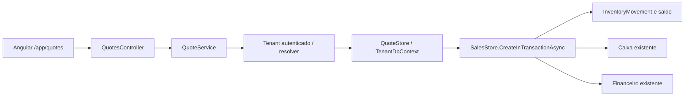
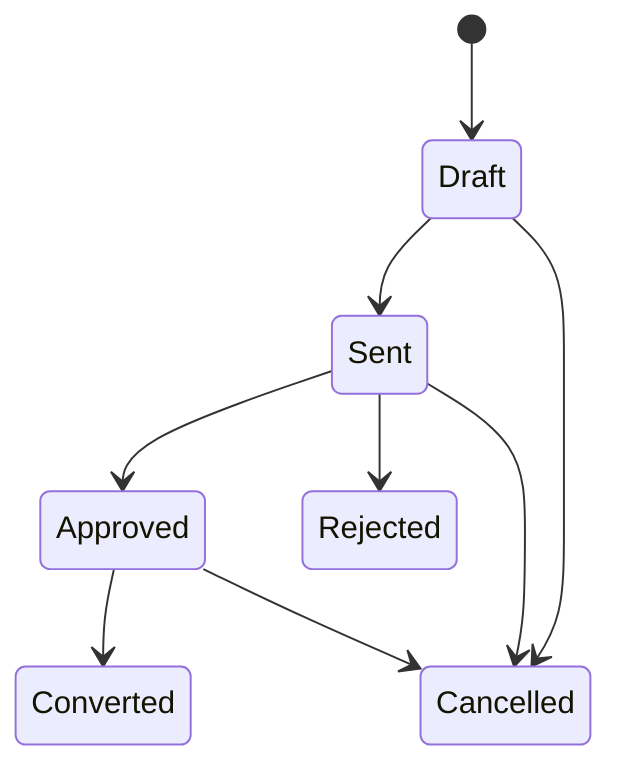

# Orçamentos comerciais V1

## Escopo e arquitetura

Implementação nas camadas existentes Domain → Application → Infrastructure, exposta por Forjix.Api e Angular standalone. Nenhuma dependência externa foi adicionada. Orçamento não reserva estoque, não gera caixa ou contas a receber. A conversão aprovada reutiliza o núcleo transacional de SalesStore, preservando o fluxo de estoque, caixa e Financeiro V1.

Somente o tenant derivado da identidade autenticada é utilizado. Não há TenantId nas tabelas operacionais, connection string fixa nem alteração do Master.

## Entidades e tabelas

Migration do tenant: **20260926144839_AddQuotesV1**.

| Entidade / tabela | Campos e finalidade |
| --- | --- |
| Quote / Quotes | Id GUID PK; Number nvarchar(40) único; CustomerId GUID FK Customers; IssueDate/ValidUntil date; Status int; Notes nvarchar(2000) opcional; Subtotal/Discount/Total decimal(18,2); UserId/UpdatedByUserId GUID FKs Users; SaleId GUID FK Sales opcional; ConvertedAt datetimeoffset opcional; CreatedAt/UpdatedAt datetimeoffset; RowVersion rowversion. |
| QuoteItem / QuoteItems | Id GUID PK; QuoteId GUID FK Quotes; ProductId GUID FK Products; ProductName nvarchar(180), Sku nvarchar(60), snapshots obrigatórios; Quantity decimal(18,3); UnitPrice/Discount/Total decimal(18,2). |
| QuoteSequence / QuoteSequences | Id int PK não gerado, singleton 1; LastValue bigint; RowVersion rowversion. Contador independente por banco/tenant. |

Número ORC-000001 crescente, sem reinício anual. O mecanismo de venda tem semântica distinta; o contador foi implementado especificamente para orçamento. Escrita Serializable, rowversion e índice único protegem a sequência; conflitos/deadlocks retornam 409, sem retries invisíveis. Não usa MAX(Id)+1.

Índices: Number único; CustomerId; UserId; UpdatedByUserId; IssueDate; ValidUntil; (Status,ValidUntil); SaleId único filtrado não nulo; (QuoteId,ProductId) único e ProductId nos itens. FKs restritivas, exceto Quote → QuoteItems com cascade.

Constraints: quantidades positivas; valores não negativos; total do item igual a ROUND(Quantity * UnitPrice,2) menos Discount; Total do orçamento não superior ao Subtotal; validade não anterior à emissão; status persistido 0,1,2,3,5,6; Converted exige SaleId e ConvertedAt e demais status proíbem ambos. QuoteSequences exige Id=1 e contador não negativo. A coerência completa dos descontos gerais é calculada no domínio/aplicação.

## Status e regras

Draft=0, Sent=1, Approved=2, Rejected=3, Expired=4, Converted=5, Cancelled=6.

Expired é uma projeção temporal, não um status gravado: Draft/Sent/Approved cuja validade seja anterior ao dia UTC atual são exibidos como Expired. Estados terminais permanecem terminais. Vencido não pode ser enviado, aprovado ou convertido; pode ser cancelado. Um rascunho vencido pode ser editado para renovar a validade, identificado por IsEditable no DTO. Somente o estado original Draft permite edição. Rejected/Cancelled/Converted são imutáveis comercialmente.

Rejeição e cancelamento exigem motivo (até 500 caracteres), registrado na auditoria. “Enviar” apenas marca como apresentado/enviado; não envia e-mail, WhatsApp ou integração externa.

Cliente ativo obrigatório; 1 a 200 itens, produtos ativos do mesmo tenant e sem repetição; quantidade positiva com até 3 casas; valores com até 2 casas; observações até 2000 caracteres. Datas e dinheiro respeitam os tipos existentes. Total é recalculado no servidor:

- bruto do item = arredondamento comercial de quantidade × preço para 2 casas;
- total do item = bruto − desconto do item;
- subtotal = soma dos brutos;
- total do orçamento = soma dos totais dos itens − desconto geral.

Desconto não pode produzir total negativo. Totais e preços não são aceitos do frontend. UnitPrice, nome e SKU são snapshots do catálogo, preservados na edição dos itens existentes e na venda convertida; itens recém-incluídos usam o catálogo atual. Não há override manual de preço nem acréscimo, pois o fluxo atual de vendas não oferece essas operações.

## API e modelos

Controller: QuotesController. Serviço: IQuoteService / QuoteService. Persistência: IQuoteStore / QuoteStore e IQuoteStoreFactory / QuoteStoreFactory.

| Verbo | Rota /api/quotes | Permissão | Entrada → saída |
| --- | --- | --- | --- |
| GET | / | quotes.view | QuoteFilter → PagedQuotes |
| GET | /summary | quotes.view | → QuoteSummary |
| GET | /{id} | quotes.view | → QuoteView |
| POST | / | quotes.create | SaveQuoteRequest → QuoteView, 201 |
| PUT | /{id} | quotes.edit | SaveQuoteRequest → QuoteView |
| POST | /{id}/send | quotes.status | QuoteActionRequest → QuoteView |
| POST | /{id}/approve | quotes.status | QuoteActionRequest → QuoteView |
| POST | /{id}/reject | quotes.status | QuoteActionRequest → QuoteView |
| POST | /{id}/cancel | quotes.cancel | QuoteActionRequest → QuoteView |
| POST | /{id}/convert-to-sale | quotes.convert | ConvertQuoteRequest → SaleView |
| GET | /{id}/pdf | quotes.print | → application/pdf |

Sete permissões no catálogo e migration; a migration concede apenas ao grupo de sistema ADMINISTRADOR existente. Outros grupos devem receber permissões explicitamente. UI e rotas usam o permissionamento atual; backend verifica independentemente.

SaveQuoteRequest: CustomerId, ValidUntil, Discount, Notes, Items(ProductId,Quantity,Discount), RowVersion na edição. QuoteActionRequest: RowVersion e Reason. ConvertQuoteRequest: RowVersion, PaymentMethod e FinancialTerms opcional conforme pagamento. RowVersion é Base64 de 8 bytes. Request inválido retorna 400, não encontrado 404, acesso negado 403 e conflito/transição inválida 409, via Problem Details existente.

Filtros: Search (número), CustomerId, Status, From/Through (emissão), ExpiredOnly, ConvertedOnly, Page e PageSize; máximo 100 registros por página. Filtros combinados são restritivos. Ordenação por emissão decrescente e número decrescente. QuoteView inclui itens, responsável, estado temporal, IsEditable, SaleId, ConvertedAt e RowVersion.

## Conversão, estoque, caixa e financeiro

QuoteStore abre uma transação Serializable no banco resolvido do tenant e valida orçamento Approved não vencido, cliente ativo e rowversion. SalesStore.CreateInTransactionAsync executa o mesmo núcleo de criação de venda utilizado pela API existente, na mesma conexão/contexto/transação. Preços/descrições/descontos vêm do snapshot do orçamento; custos e disponibilidade são atuais.

Além de quotes.convert, exige sales.create; descontos exigem sales.discount; venda a prazo exige financial.receivable.manage. A conta de categoria e demais condições financeiras seguem o Financeiro V1. Exige caixa aberto conforme regra existente, mesmo para pagamentos não físicos. Dinheiro movimenta caixa físico; Deferred gera recebíveis pelo gerador existente; demais formas mantêm comportamento atual.

Após sucesso, Quote recebe SaleId/ConvertedAt/Converted e auditoria. Falha em qualquer etapa, inclusive concorrência no orçamento após gravar a venda dentro da transação, reverte venda, saldo, movimentos, títulos e auditorias. Orçamento convertido não pode gerar outra venda. SaleId único também impede reutilização de uma venda. Não há endpoint público de override dos snapshots.

Cancelar posteriormente a venda não reabre o orçamento: cancelamento da venda continua no módulo de vendas. Não há reserva de estoque, aprovação pública, serviços avulsos, automação de envio ou integração fiscal nesta V1.

## Angular e PDF

Feature em features/quotes/quotes.ts/html, serviço core/api/quotes-api.service.ts, rota lazy /app/quotes, menu Comercial → Orçamentos. Reactive Forms com FormArray, filtros, paginação, cadastro/edição, detalhe e confirmação das ações; descontos e ações condicionados a permissões. Clientes/produtos/categorias financeiras vêm dos serviços existentes e exigem suas permissões de consulta. Seletores carregam até 100 registros, conforme o padrão atual; buscas remotas para catálogos maiores não foram adicionadas.

PDF reutiliza o mecanismo direto de objetos/xref extraído de AnalyticsService para Common/PdfDocument. QuotePdf monta várias páginas com empresa, logo, número, cliente, emissão, validade, responsável, produtos/SKU, quantidades, preços, descontos, totais e notas. Usa as configurações **atuais** da empresa e cliente; não cria snapshot de cabeçalho corporativo. Nomes/SKU/preços dos itens são históricos.

Limitações verificáveis: fonte Helvetica/WinAnsi com texto Latin1 (não cobre todo Unicode); logo PNG 8 bits não entrelaçado ou JPEG 8 bits RGB/cinza, até 4 milhões de pixels. WEBP, PNG entrelaçado/outras profundidades e JPEG CMYK não suportados; retornam validação 400 em vez de produzir documento incorreto. Transparência alfa PNG é composta sobre branco; tRNS de paletas não é interpretado. Não há biblioteca externa de imagem/PDF. PDF sem logo funciona quando nenhuma imagem foi configurada.

## Dashboard, auditoria e seed

Resumo do mês corrente UTC: quantidade e valor orçado, Approved, Pending (Sent), Converted, Expired e taxa percentual. Taxa = convertidos / finalizados × 100; finalizados são Converted/Rejected/Cancelled e vencidos que não permaneçam no estado persistido Draft. Drafts e drafts vencidos não entram no denominador. Cancelled conta como finalizado mesmo se cancelado antes de enviar, pois não há histórico SentAt no modelo. Quantidade/valor do mês incluem rascunhos, sem afetar a taxa.

Dashboard exibe três cartões compactos apenas com quotes.view. Auditoria usa AuditLog existente: QuoteCreated, QuoteUpdated, QuoteSent, QuoteApproved, QuoteRejected, QuoteCancelled e QuoteConverted, com identificação e dados comerciais/motivo, sem segredos.

Migrador continua como único executor de migrations. Seed comercial de Development/homologação adiciona dois exemplos determinísticos (Draft e Approved), cliente demonstrativo e contador, apenas quando o seed comercial é habilitado. IDs fixos e verificação de existência evitam duplicação; não recria orçamentos já existentes e não movimenta estoque/financeiro. IntegrationSeed não cria exemplos: testes exercitam os endpoints.

## Testes e validação automatizada

Novos arquivos: QuoteTests (11 casos Domain), QuoteServiceTests (8 Application), quotes-api.service.spec.ts (5 Angular) e quotes.spec.ts (7 Angular). Dois testes extensos foram adicionados a SqlServerAcceptanceTests.

Cobertura: cálculos/precisão/descontos/status/imutabilidade; requests e permissões; listagem, edição e ações Angular; PDF com múltiplas páginas, acentos e PNG; isolamento físico dos tenants, endpoints, referências inválidas, filtros, snapshots, rowversion, conversão duplicada, ausência de movimentos antes da conversão e rollback de caixa/estoque/financeiro em SQL Server real. O teste Application de falha usa mock; a atomicidade é demonstrada nos testes SQL, não no mock.

Gate final: build Release .NET com zero warnings/erros; 97 testes .NET (31 Domain,29 Application,37 Integration), sem ignorados com opt-in SQL real; build production Angular e 30 testes Angular. Migrador executado duas vezes no banco CI isolado; verificação EF sem alterações pendentes de modelo. Nenhuma homologação manual, deploy, commit ou push.

## Arquivos desta entrega

Criados:

- Domain: Entities/Quotes/Quote.cs, QuoteItem.cs e Enums/QuoteStatus.cs.
- Application: Abstractions/Quotes/IQuoteStore.cs; Features/Quotes/IQuoteService.cs, QuoteService.cs, QuoteModels.cs, QuotePdf.cs; Common/PdfDocument.cs.
- Infrastructure: Quotes/QuoteStore.cs, Persistence/Tenant/QuoteModelConfiguration.cs e migration AddQuotesV1 com Designer.
- API: Controllers/QuotesController.cs.
- Angular: core/api/quotes-api.service.ts e .spec.ts; features/quotes/quotes.ts, quotes.html e quotes.spec.ts.
- Testes: Domain/QuoteTests.cs e Application/QuoteServiceTests.cs.
- Documentação: este documento.

Alterados: DI Application/Infrastructure; Permissions; AuditAction; TenantDbContext e snapshot; SalesStore (extração do núcleo compartilhado preservando a API); AnalyticsService (PDF compartilhado); DatabaseMigrator; SqlServerAcceptanceTests; Angular app.routes, layout autenticado e dashboard; índice e referências dos documentos.

As alterações anteriores do Financeiro V1 foram preservadas. Elas continuam no mesmo worktree sem commit e não devem ser confundidas com arquivos introduzidos exclusivamente nesta etapa.
