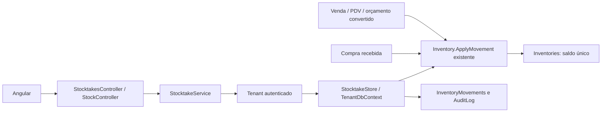
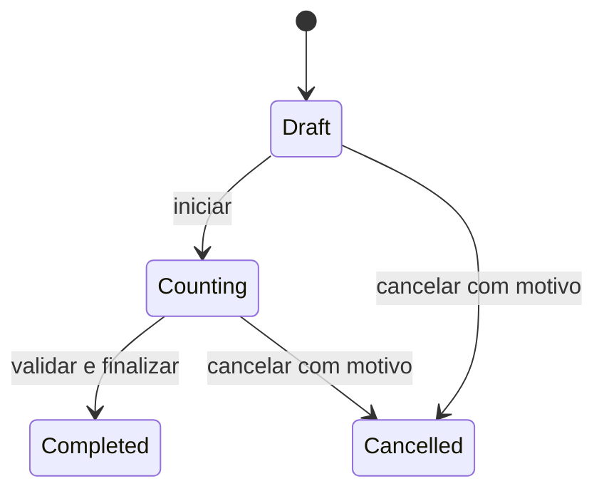

# Estoque Avançado / Inventário V1

## Visão funcional e arquitetura

Evolução do estoque existente, sem segunda implementação de saldo. Inventory / Inventories já representa **o saldo por produto**; por isso o processo formal de inventário foi chamado Stocktake / Stocktakes. Não foram renomeadas tabelas nem substituídos os fluxos antigos.

O mínimo já existe em Product.MinimumStock, decimal(18,3), e continua cadastrado em Produtos. A validação agora impede valores negativos, fora de faixa ou com mais de 3 casas. Todos os produtos atuais possuem Inventory e são controlados; não foi criada uma flag que mudaria implicitamente venda/compra/PDV. Estoque máximo era opcional no pedido e não foi acrescentado nesta V1.

Mantidas camadas Domain, Application, Infrastructure e API; Angular standalone, lazy routes, Reactive Forms, guards e policies existentes. Nenhuma biblioteca nova. Tenant autenticado resolve seu próprio DbContext; nenhum dado operacional vai para ForjixMaster.

## Modelo e migration

Migration tenant: **20260926150829_AddAdvancedInventoryV1**.

| Entidade / tabela | Conteúdo |
| --- | --- |
| Stocktake / Stocktakes | Id uniqueidentifier PK; Number nvarchar(40) obrigatório e único; Status int; Notes nvarchar(2000) opcional; UserId e UpdatedByUserId FKs Users; OpenedAt e UpdatedAt datetimeoffset obrigatórios; StartedAt e ClosedAt datetimeoffset opcionais; RowVersion rowversion. |
| StocktakeItem / StocktakeItems | Id GUID PK; StocktakeId FK Stocktakes; ProductId FK Products; ExpectedQuantity decimal(18,3); CountedQuantity decimal(18,3) opcional; Notes nvarchar(500) opcional; CountedAt datetimeoffset e CountedByUserId FK Users opcionais; StockRowVersion varbinary(8) obrigatório. |
| StocktakeSequence / StocktakeSequences | Id int PK não gerado, singleton 1; LastValue bigint; RowVersion rowversion. |

Difference é calculada como CountedQuantity − ExpectedQuantity; não é coluna redundante nem saldo disponível. ExpectedQuantity é uma referência histórica da contagem, não segunda fonte de saldo.

Campos adicionados em InventoryMovements: ReasonCode nvarchar(30) e Observation nvarchar(500), ambos opcionais, sem invalidar histórico antigo. Mantidos Type, Quantity, PreviousQuantity, NewQuantity, Reason, ReferenceType, ReferenceId, UserId e CreatedAt.

Índices: Stocktakes.Number único; OpenedAt; (Status,OpenedAt); UserId/UpdatedByUserId; StocktakeItems (StocktakeId,ProductId) único, ProductId e CountedByUserId; InventoryMovements (ProductId,CreatedAt). FKs restritivas para produto/usuários; exclusão de Stocktake em cascata para itens. Constraints de status/fechamento, contagem não negativa com autoria/data e contador singleton não negativo.

Migration inclui sete permissões e concessão ao grupo de sistema ADMINISTRADOR existente, com GrantedAt UTC. Downgrade remove somente as permissões novas e as estruturas/campos adicionados; elimina dados de inventários se executado. Não foi executado downgrade em ambiente operacional.

## Estados, numeração e processo

Draft=0, Counting=1, Completed=2, Cancelled=3.

- Criação/edição Draft seleciona 1 a 1000 produtos distintos e ativos do tenant, com estoque existente. Não movimenta saldo.
- Início captura referência atual de cada produto e passa para Counting. Não movimenta saldo.
- Contagem aceita lotes parciais, inclusive zero, com até 3 casas; autoria/data e observação por item. Não movimenta saldo.
- Finalização exige todos os itens contados e aplica ajustes incrementais apenas para diferenças não nulas.
- Cancelamento exige motivo e não altera estoque.
- Completed/Cancelled não podem ser editados, contados, reiniciados ou finalizados novamente.

Número INV-000001 usa contador por banco e transação Serializable, seguindo o padrão seguro adotado em Orçamentos. Índice único e rowversion protegem concorrência. Não usa MAX + 1, não reinicia por ano e conflitos retornam 409 para atualização/retry explícito.

## Concorrência e atomicidade

O orçamento não reserva estoque; tampouco o inventário bloqueia a operação comercial durante todo o período de contagem.

1. Cada envio de contagem confirma o físico **naquele instante** e registra o saldo esperado e rowversion atuais do produto.
2. Se houver venda, compra, cancelamento ou movimento manual após essa confirmação, a versão do saldo muda.
3. Finalização abre transação Serializable, lê todos os saldos e valida todas as versões antes de gerar qualquer ajuste.
4. Qualquer versão divergente retorna 409 e mantém o inventário Counting, sem ajuste parcial.
5. O operador deve realizar nova contagem do produto afetado; não há “ignorar conflito”.
6. Diferença positiva chama Inventory.ApplyMovement(PositiveAdjustment, diferença); negativa chama NegativeAdjustment com o módulo da diferença. Não se atribui Stock.Quantity diretamente.
7. Saldo, movimentos, fechamento e auditoria são salvos na mesma transação. Falha ou concorrência reverte a operação.

Leituras de saldos permanecem protegidas pelo isolamento Serializable até commit. Rowversion também protege o documento Stocktake contra duas contagens/finalizações concorrentes. Uma segunda finalização não cria movimentos duplicados; deadlocks/conflitos retornam 409.

A precisão/validade das quantidades físicas depende de o operador confirmar uma contagem atual. A UI envia somente linhas alteradas (quantidade ou observação), não reenvia automaticamente os demais itens contados, e oferece Recontar, que limpa o valor para nova digitação. Alterar a observação de uma linha também confirma essa contagem; a tela informa que salvar atualiza sua referência. Finalização não é oferecida enquanto há alterações locais não salvas.

Contagens longas podem exigir recontagem em operações com alto giro. Não há reserva, congelamento de PDV, bloqueio distribuído, tolerância automática ou ajuste cego de snapshots antigos.

## Ajuste manual e histórico

Endpoint específico aceita PositiveAdjustment/NegativeAdjustment, quantidade positiva, motivo estruturado e observação. Motivos: Loss, Damage, Expiration, OperationalError, Return, Correction, Other. Inventory é reservado à finalização de inventário e não pode ser informado para falsificar essa origem.

Ajuste reutiliza InventoryService, InventoryStore e Inventory.ApplyMovement, com política vigente de estoque negativo e rowversion do saldo. Endpoint e service exigem stock.adjust. O endpoint antigo /api/inventory/{productId}/movements continua com stock.manage; se o tipo for ajuste, também exige stock.adjust no service. A UI antiga não mostra tipos de ajuste sem essa permissão. Entradas/saídas comuns antigas permanecem sob stock.manage. Origem Sale/Purchase/SaleCancellation não pode ser simulada por esse endpoint manual: deve usar o fluxo comercial real.

Histórico global exibe entrada/saída, antes/depois, produto/SKU, tipo, usuário, motivo/observação e origem/documento. ReferenceType + ReferenceId existentes são reaproveitados, sem FK polimórfica:

- Sale → número da venda; cancelamento identifica-se também por Type=SaleCancellation;
- Purchase → número da compra;
- Stocktake → número INV e ID do documento;
- ManualAdjustment → movimento manual, sem documento externo;
- DevelopmentSeed ou origem ausente são preservados.

Números são resolvidos no banco autenticado, em lote por página. Registros históricos sem origem não são artificialmente relacionados a documentos.

## Indicadores e relatórios

A visão geral usa produtos ativos e saldo real:

- ControlledProducts: quantidade de produtos ativos com estoque cadastrado;
- OutOfStock: saldo <= 0, incluindo negativos;
- LowStock: saldo > 0 e <= mínimo, separado dos sem estoque;
- NearMinimum: mínimo > 0 e saldo > mínimo, até 20% acima;
- OngoingInventories: Stocktake em Counting (Draft não é contagem em andamento);
- EstimatedValue: soma de saldo × custo **atual** do produto.

Os status existentes Negative, OutOfStock, Low e Normal continuam compatíveis. Zero/negativo ficam separados de Low; o relatório de reposição inclui saldo <= mínimo, incluindo zerados. A classificação não é persistida.

Relatório low-stock: produto, SKU, saldo, mínimo, MAX(mínimo − saldo,0), última movimentação e valor estimado. A igualdade com mínimo também aparece por compatibilidade com o alerta existente; sugestão nesse caso é zero.

Relatório no-movement: 30/60/90 dias ou período personalizado, produto ativo já cadastrado no início e sem InventoryMovement no intervalo inclusivo. Inclui nunca movimentados. Última movimentação apresentada é a última conhecida globalmente, não apenas no filtro. O saldo e custo apresentados são atuais, **não um fechamento histórico**. Fim superior ao instante atual é limitado ao instante atual. Produto criado durante o intervalo não é classificado como parado por todo o período.

Custo existe no domínio e é reutilizado; não foi inventado custo médio, valuation fiscal ou lucro. Saldos negativos autorizados podem gerar valor estimado negativo, sinalizando divergência operacional. Relatórios não geram compra. Não há e-mail/push, exportador novo ou rotinas agendadas; exportações gerais existentes permanecem intactas.

## Endpoints e permissões

| Verbo | Rota | Permissão | Request → response |
| --- | --- | --- | --- |
| GET | /api/stock/overview | stock.view | → StockOverview |
| GET | /api/stock/movements | stock.view | StockMovementFilter → PagedResult<StockMovementView> |
| POST | /api/stock/adjustments | stock.adjust | StockAdjustmentRequest → InventoryMovementResult |
| GET | /api/stock/reports/low-stock | stock.reports | → StockReportItem[] |
| GET | /api/stock/reports/no-movement | stock.reports | days/from/to → StockReportItem[] |
| GET | /api/inventories | stock.inventory.view | StocktakeFilter → PagedResult<StocktakeView> |
| GET | /api/inventories/{id} | stock.inventory.view | → StocktakeView |
| POST | /api/inventories | stock.inventory.create | SaveStocktakeRequest → StocktakeView (201) |
| PUT | /api/inventories/{id} | stock.inventory.create | SaveStocktakeRequest com RowVersion → StocktakeView |
| POST | /api/inventories/{id}/start | stock.inventory.count | StocktakeActionRequest → StocktakeView |
| POST | /api/inventories/{id}/count | stock.inventory.count | CountStocktakeRequest → StocktakeView |
| POST | /api/inventories/{id}/complete | stock.inventory.complete | StocktakeActionRequest → StocktakeView |
| POST | /api/inventories/{id}/cancel | stock.inventory.cancel | StocktakeActionRequest com motivo → StocktakeView |

Sete permissões novas: stock.adjust, stock.inventory.view/create/count/complete/cancel e stock.reports. Total atual do catálogo: 52 permissões de produto (marcadores de CI são adicionais). Nenhuma autorização por nome de role no fluxo normal.

Listagem filtra número, status, período de abertura e paginação (máximo 100/página). Movimentos filtram produto, período, tipo, origem e usuário (máximo 100/página). Versões são Base64 de 8 bytes. Requests inválidos retornam 400, desconhecidos 404, permissão negada 403, concorrência/transição inválida 409, usando Problem Details existente.

Menus/rotas são condicionais. Para selecionar produtos nas telas de criação/ajuste, o grupo também precisa de stock.view; operações por ID continuam verificadas pelo backend independentemente do menu.

## Angular, integração e seeds

Visão geral reutiliza InventoryList; novos indicadores também aparecem no dashboard apenas com stock.view. Menus acrescentam Movimentações, Inventários, Ajuste manual e Relatórios de estoque. Stocktakes oferece lista/filtros, seleção pesquisável de produtos, edição Draft, abertura, contagem FormArray pesquisável, diferenças e confirmação de operações. Carregamento, erros e sucesso seguem sinais/padrões existentes.

StockOperations tem modos lazy para movimentos, ajustes e relatórios. Novos serviços usam o interceptor/autenticação existente. Nenhum NgModule.

Compras recebidas, vendas, PDV, cancelamentos e orçamentos convertidos continuam aplicando Inventory.ApplyMovement e InventoryMovements. Seus movimentos invalidam versões de contagens antigas por consequência natural. Nenhum título financeiro é criado pelo inventário/ajuste.

Seed comercial opt-in de desenvolvimento/homologação acrescenta um produto zerado, um inventário Counting e um Completed sem divergência. Produtos normal/baixo existentes são reutilizados. IDs fixos e existência verificadas, contador crescente; não sobrescreve documentos existentes nem força saldo, não gera movimentos ou financeiro. IntegrationSeed não adiciona esses exemplos. Seed comercial foi inspecionado e compilado; sua execução em homologação não foi feita. Idempotência do migrador CI é validada por duas execuções.

Auditoria registra StocktakeCreated/Updated/Started/Counted/Completed/Cancelled e StockAdjusted em AuditLog existente. Eventos são por operações/lotes, não por digitação.

## Testes e gate

Novos casos: 11 Domain, 8 Application, 5 Integration SQL e 24 Angular.

- Domain: diferenças positivas/negativas/zero, quantidade inválida, estados, fechamento único e ajustes pelo saldo existente.
- Application: tenant autenticado, validação, criação/edição, início/finalização, contagem em lote, cancelamento, relatórios/indicadores e proteção contra origem forjada.
- SQL real: ciclo e persistência, antes/depois, sem alterações antes de finalizar, concorrência de duas finalizações, estoque movimentado depois da contagem, ausência de ajustes parciais, auditoria, filtros/rastreabilidade, ajuste positivo/negativo, precisão, saldo insuficiente, relatórios e permissões.
- Isolamento: outro tenant não lê inventário/estoque/documentos nem usa produto estrangeiro.
- Upgrade: banco migrado até AddQuotesV1, administrador existente, aplicação do novo schema/permissões com GrantedAt.
- Angular: serviços HTTP, paginação, contagem zero/blank, alterações locais, não reenvio de contagens antigas, estados, ajuste com rowversion, conflitos, relatórios e indicadores.

Falha simulada em Application não comprova rollback SQL; os testes físicos são o gate de atomicidade. A suíte preserva regressões de autenticação, tenancy, Financeiro e Orçamentos.

Resultados: **121 testes .NET**, sendo 42 Domain,37 Application,42 Integration, zero falhas/ignorados com SQL real habilitado; **54 testes Angular**. Builds Release .NET e production Angular sem erros/warnings. Migration aplicada em bancos novos, upgrade de banco existente testado, migrador CI executado duas vezes; EF sem modelo pendente. Sem commit, push, deploy ou homologação manual.

## Arquivos desta etapa

Criados:

- src/Forjix.Domain/Entities/Inventory/Stocktake.cs
- src/Forjix.Domain/Enums/StocktakeStatus.cs
- src/Forjix.Application/Abstractions/Inventory/IStocktakeStore.cs
- src/Forjix.Application/Features/Inventory/StocktakeModels.cs, IStocktakeService.cs, StocktakeService.cs
- src/Forjix.Infrastructure/Inventory/StocktakeStore.cs
- src/Forjix.Infrastructure/Persistence/Tenant/StocktakeModelConfiguration.cs
- src/Forjix.Infrastructure/Persistence/Tenant/Migrations/20260926150829_AddAdvancedInventoryV1.cs e .Designer.cs
- src/Forjix.Api/Controllers/StockController.cs e StocktakesController.cs
- web/forjix-web/src/app/core/api/stock-api.service.ts e .spec.ts
- web/forjix-web/src/app/features/inventory/stocktakes/stocktakes.ts, .html, .spec.ts
- web/forjix-web/src/app/features/inventory/stock-operations/stock-operations.ts, .html, .spec.ts
- web/forjix-web/src/app/features/inventory/inventory-list/inventory-list.spec.ts
- tests/Forjix.Domain.Tests/StocktakeTests.cs
- tests/Forjix.Application.Tests/StocktakeServiceTests.cs
- docs/14-estoque-avancado.md

Alterados:

- Application/Infrastructure DependencyInjection; Application/Common/Permissions; Domain/Enums/AuditAction
- Domain/Entities/Inventory/InventoryMovement; Application/Features/Inventory/InventoryModels e InventoryService; Infrastructure/Inventory/InventoryStore
- Application/Features/Management/ManagementService (precisão do mínimo)
- Infrastructure/Persistence/Tenant/TenantDbContext e TenantDbContextModelSnapshot
- tools/Forjix.DatabaseMigrator/Program.cs; tests/Forjix.IntegrationTests/SqlServerAcceptanceTests.cs
- Angular app.routes; layout autenticado; inventory-list e inventory-movement-dialog TS/HTML; dashboard TS/HTML
- docs/README e referências de banco, módulos, API, migrations e roadmap

As alterações anteriores de Financeiro/Orçamentos permanecem no worktree, sem commit. Não foram descartadas nem tratadas como arquivos novos desta entrega.
